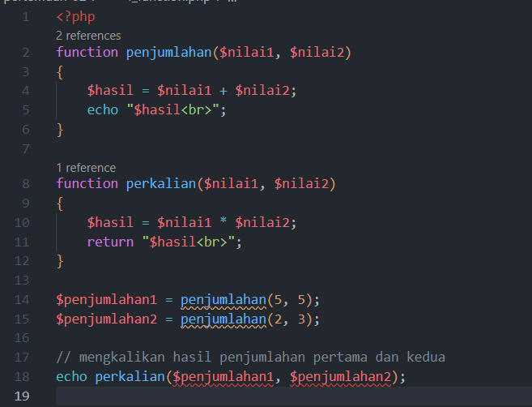
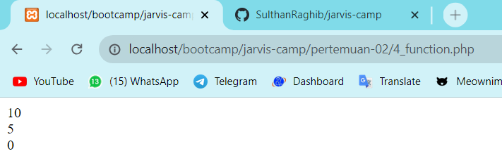
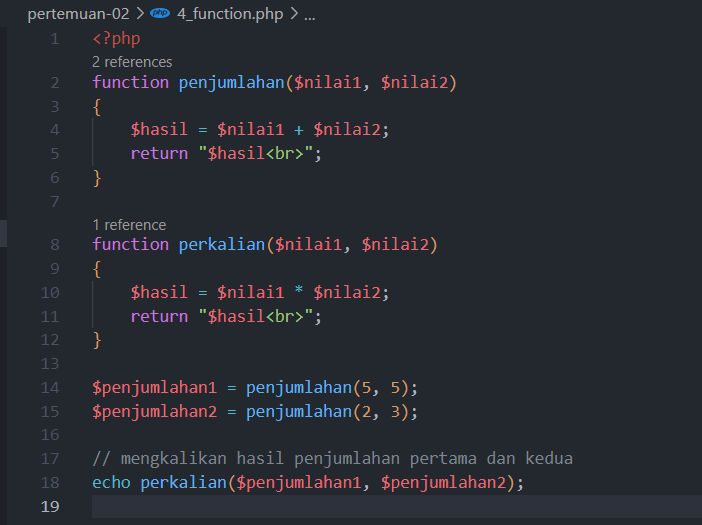
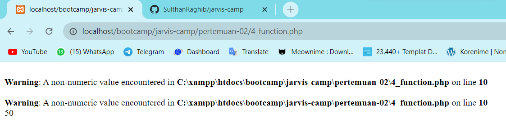

<!-- Ceritakan apa saja yang telah kalian pelajari di pertemuan kali ini pada summary.md-->

## 1. Pengenalan PHP

dalam file `1_coba.php` saya belajar cara menampilkan output di php dengan menggunakan `echo` dan dalam `echo` juga bisa menggunakan tag html.

## 2. Variable PHP

dalam file `2_variable.php` saya belajar cara mendeklarasikan variable di php dan cara menampilkan variable di php.

## 3. Tipe Data PHP

dalam file `3_tipe_data.php` saya belajar tentang tipe data di php ada tipe data integer, float, string, boolean, array: index, array: assosiatif.

## 4. Function PHP

dalam pembelajaran function dengan menggunakan `echo` untuk menampilkan output dari penjumlahan tidak terjadi error, tetapi dalam kasus saya menggunakan `echo` error

apabila menggunakan `return` tidak terjadi error, yang error hanya pada saat menampilkan output dari penjumlahan

